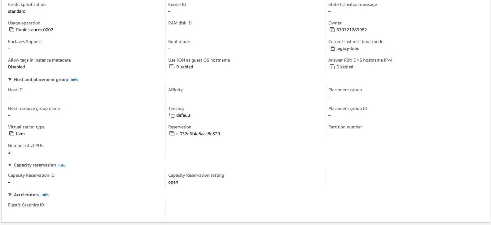
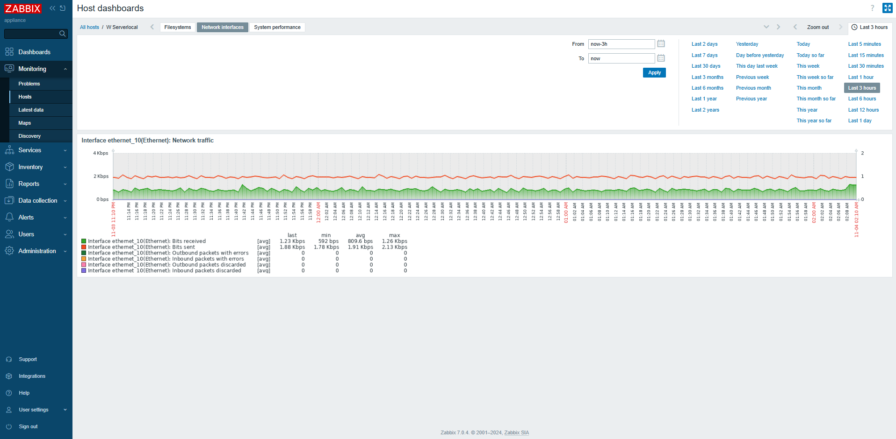
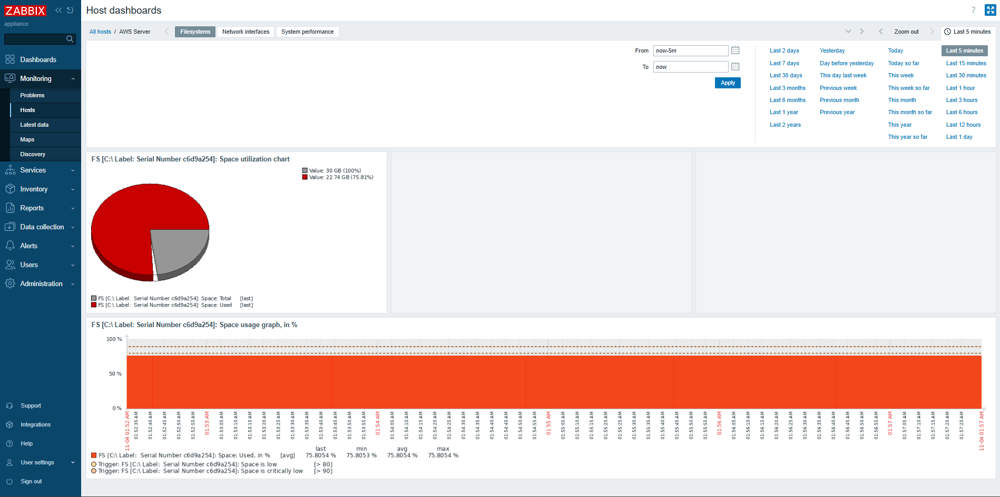
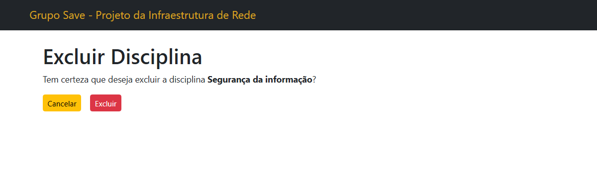

# Título do Projeto

`CURSO: Sistemas de Informação`

`DISCIPLINA: Projeto - Projeto de Infraestrutura`

`Eixo: 5`

O presente projeto é desenvolvido em função da inauguração de três novos
campi da faculdade Centro Educacional Save. A sede da instituição é localizada na
cidade de Belo Horizonte, Minas Gerais, ao passo que os novos campi serão instituídos
nas cidades de Contagem, Juiz de Fora e Uberlândia, todas em Minas Gerais.

Em função da inauguração, será necessária a estruturação de um projeto de redes,
explicitando como será a divisão lógica e física da rede nos campi, com os devidos
Nomes e Endereços dos servidores, as faixas de rede utilizadas em CIDR e NAT, bem
como eventuais tabelas de roteamento e serviços de rede de acordo com o protótipo a
ser desenvolvido no escopo do projeto.

## Integrantes

* Amanda Furtado de Souza
* Bárbara Lemos
* Diovana Tavares dos Reis
* Gianluca de Oliveira Martins Antonio
* Giovanny de Sales Brito
* Pedro Henrique Costa Andrade
* Romario Cordeiro Medeiros

## Orientador

* Alexandre Teixeira

# 1. Introdução
## 1.1 Contexto
O presente projeto é desenvolvido em função da inauguração de três novos
campi da faculdade Centro Educacional Save. A sede da instituição é localizada na
cidade de Belo Horizonte, Minas Gerais, ao passo que os novos campi serão instituídos
nas cidades de Contagem, Juiz de Fora e Uberlândia, todas em Minas Gerais.
Em função da inauguração, será necessária a estruturação de um projeto de redes,
explicitando como será a divisão lógica e física da rede nos campi, com os devidos
Nomes e Endereços dos servidores, as faixas de rede utilizadas em CIDR e NAT, bem
como eventuais tabelas de roteamento e serviços de rede de acordo com o protótipo a
ser desenvolvido no escopo do projeto.

O campus de Contagem terá 80 computadores, cerca de 120 funcionários e com
a possibilidade de um total de 2.800 usuários logados simultaneamente na rede. Já os
campi de Juiz de Fora e Uberlândia contarão com, respectivamente, 95 e 78
computadores, 130 e 110 funcionários, existindo a possibilidade de 3.000 e 2.600
usuários logados. Por sua vez, o campus sede, que tem em sua rede 101 computadores,
150 funcionários e a possibilidade de um total de 3.620 usuários. Os serviços em todos
os campi serão distribuídos entre os setores: o Setor de Funcionários, o Setor
Acadêmico (para coordenadores de curso, secretarias acadêmicas e apoio aos alunos), o
Setor de Segurança (para controle de acesso e monitoramento), o setor de infraestrutura
(TI), o Setor Administrativo (RH, financeiro e compras), a Biblioteca e Documentação
(gerenciamento de acervo, apoio a alunos e professores) e os Laboratórios e Pesquisa
(gerenciamento de laboratórios de ensino e pesquisa) Setor do Aluno.

A implementação de uma rede interconectada entre os todos campi é
fundamental para garantir a eficiência operacional da faculdade, permitindo que os
sistemas acadêmicos e administrativos funcionem de forma integrada,
independentemente da localização física dos usuários. A crescente demanda por
conectividade e a dependência de sistemas digitais tornam a confiabilidade e a
segurança da rede essenciais para a operação das instituições a satisfação dos usuários,
incluindo alunos e funcionários.

A estimativa geral do número de computadores no campus de Belo Horizonte
considera os dispositivos em diferentes ambientes, como: 1 por sala de aula (15
computadores no total), 60 distribuídos nos laboratórios, 3 dispositivos na biblioteca, 17
aparelhos nos espaços administrativos, 1 na sala de reuniões e 5 outros computadores
em áreas comuns, totalizando cerca de 101 computadores e 25 pontos de acesso
distribuídos pela faculdade. O número de funcionários foi estimado com base nas
necessidades administrativas, de suporte técnico e de ensino, incluindo
aproximadamente 120 professores, 20 funcionários administrativos e cerca de 10
funcionários dedicados à segurança, limpeza e manutenção, totalizando
aproximadamente 150 funcionários.

A mesma estimativa em relação aos campi filiais, sendo estabelecida a relação
descrita a seguir. Contagem: 80 computadores, 1 por sala de aula (12 no total), 46 nos
laboratórios, 3 dispositivos na biblioteca, 13 nos espaços administrativos, 1 na sala de
reuniões e outros 5 nas áreas comuns; 120 funcionários, 95 professores, 15 funcionários
administrativos e 10 funcionários de segurança. Juiz de Fora: 95 computadores, 1 por
sala de aula (14 no total), 51 nos laboratórios, 3 na biblioteca, 16 nos espaços
administrativos, 1 na sala de reuniões e outros 5 nas áreas comuns; 130 funcionários,
100 professores, 20 funcionários administrativos e 10 de segurança. Uberlândia: 78
computadores, 1 por sala de aula (12 no total), 45 nos laboratórios, 3 na biblioteca, 12
nos espaços administrativos, 1 na sala de reuniões e 5 nas áreas comuns; 110
funcionários, 80 professores, 20 funcionários administrativos e 10 de segurança.

## 1.2 Problema
Com a inauguração dos novos campi do Centro Educacional Save nas cidades de
Contagem, Juiz de Fora e Uberlândia, surge a necessidade de implementar uma
infraestrutura de rede robusta que possa garantir uma conectividade eficiente entre os
novos campi e a sede em Belo Horizonte. A conectividade entre os campi é essencial
para o funcionamento integrado dos sistemas acadêmicos e administrativos, permitindo
a troca de dados de forma rápida, segura e confiável. Além disso, a rede deve ser capaz
de suportar inúmeros dispositivos e utilizadores, incluindo computadores, dispositivos
móveis e outros equipamentos ligados, em todos os campi.

## 1.3 Objetivos

Os serviços de rede que serão implementados incluirão a Internet e a Intranet, servidores de arquivos e de impressão, servidores de correio eletrônico, servidores de aplicações acadêmicas como o Moodle e o Sistema de Gestão Acadêmica, sistema de gestão de bibliotecas, serviço de backup e armazenamento, firewalls e sistemas de segurança. 

Os serviços de apoio e gestão incluirão sistemas ERP para a administração geral e serviços de assistência técnica. Para as comunicações, serão utilizados serviços de VoIP e de videoconferência para aulas e reuniões à distância. Por último, os serviços de monitorização incluirão sistemas de CCTV e de controle de acesso para garantir a segurança nos campi.

### Objetivos Principais

### 1.1 - Implementação de uma rede de área local (LAN) confiável em cada campus

- Estabelecer uma rede física e lógica eficiente nos campi que permita a ligação de todos os dispositivos necessários (computadores, servidores, dispositivos de rede, etc.).
- Garantir uma cobertura Wi-Fi de alta qualidade em todo o campus para apoiar a conectividade de dispositivos móveis para estudantes, funcionários e visitantes.

### 1.2 - Interligação de campi através de uma rede privada

- Utilizar uma rede privada, como uma VPN (Virtual Private Network), ou outra solução WAN (Wide Area Network) para interligar os campi, permitindo uma comunicação segura e rápida entre a matriz e as filiais.
- Implementar medidas de segurança avançadas para proteger os dados que trafegam entre os campi.

## Objetivos Secundários

### 2.1 - Garantir a escalabilidade da rede

- A rede deve ser concebida de modo a poder ser expandida no futuro para suportar um maior número de dispositivos e utilizadores sem comprometer o desempenho.

### 2.2 - Implementar redundância e alta disponibilidade

- Estabelecer mecanismos de redundância, como múltiplas ligações à Internet e roteadores, para garantir que a rede continue a funcionar mesmo em caso de falhas.

### 2.3 - Suporte a serviços críticos de rede

- Configurar serviços essenciais, como DHCP, DNS, NAT e tabelas de roteamento, de forma eficiente para apoiar as operações diárias da instituição.

### 2.4 - Configurar QoS (Quality of Service)

- Fazer a configuração de QoS para assegurar que o tráfego será priorizado para chamadas VoIP, assegurando baixa latência e qualidade nas chamadas utilizando a Internet.

## 1.4 Justificativa
A justificativa para a implementação de um projeto de infraestrutura de redes
envolvendo campus de uma faculdade está fundamentada na necessidade de criar um
ambiente educacional moderno, interconectado e eficiente, que suporte as atividades
acadêmicas e administrativas de forma integrada. Com a expansão física e a oferta
diversificada de cursos, a criação de uma rede robusta entre os quatro campi permitirá a
otimização de recursos, o compartilhamento de informações em tempo real e o suporte a
tecnologias emergentes, como ensino híbrido e sistemas de gestão acadêmica. Além
disso, uma infraestrutura de rede bem planejada garante a segurança dos dados, a
eficiência operacional e a capacidade de escalar os serviços conforme o crescimento da
instituição, atendendo às demandas de alunos, professores e funcionários com maior
agilidade e confiabilidade.

## 1.5 Requisitos

### 1.5.1 Infraestrutura Física e Lógica

- **Equipamentos de Rede**:  
  Os campi devem ter switches de camada 2 e 3 para garantir a conectividade local e a roteabilidade entre sub-redes. Deve-se prever a aquisição de roteadores de alta capacidade e firewalls para proteção e controle de tráfego.

- **Cabeamento**:  
  A instalação deve incluir cabeamento estruturado de categoria adequada (Cat6 ou superior) para suportar velocidades de rede de até 1 Gbps, com capacidade de expansão para 10 Gbps se necessário.

- **Pontos de Acesso**:  
  Devem ser instalados pontos de acesso Wi-Fi em quantidade suficiente para garantir cobertura total e qualidade do sinal em todas as áreas do campus. A tecnologia recomendada é Wi-Fi 6 para suportar alta densidade de dispositivos e maior largura de banda.

### 1.5.2 Escalabilidade e Redundância

- **Capacidade de Expansão**:  
  A rede deve ser projetada para suportar a adição futura de novos dispositivos e usuários sem comprometer a performance. Devem ser utilizados equipamentos com portas suficientes e configuráveis para expansão.

- **Redundância de Links**:  
  Implementar links de redundância tanto para a conexão interna dos campi quanto para a conexão com a Internet, utilizando múltiplos provedores e caminhos físicos distintos para garantir alta disponibilidade.

### 1.5.3 Segurança

- **Controle de Acesso**:  
  Sistemas de controle de acesso físico para áreas sensíveis, como salas de servidores e racks de equipamentos de rede, devem ser configurados com autenticação de múltiplos fatores (MFA).

- **Segurança da Informação**:  
  Implementar criptografia para dados em trânsito e em repouso, assegurando que informações sensíveis sejam protegidas contra interceptação e acesso não autorizado.

- **Monitoramento e Resposta**:  
  Sistemas de monitoramento contínuo da rede, incluindo soluções de SIEM (Security Information and Event Management), para a análise e resposta a incidentes de segurança em tempo real.

### 1.5.4 Serviços de Rede e Comunicação

- **Serviços Internos**:  
  Configuração de servidores internos para DHCP, DNS e NAT para gerenciamento e resolução de nomes de domínio internos e externos.

- **VoIP e Videoconferência**:  
  Implementar soluções de VoIP e videoconferência com capacidade suficiente para suportar o número máximo estimado de usuários simultâneos, garantindo baixa latência e alta qualidade.

- **Backup e Recuperação**:  
  Sistemas de backup devem ser configurados para garantir a integridade e disponibilidade dos dados. A política de backup deve incluir cópias regulares e testes de recuperação.

### 1.5.5 Gerenciamento e Monitoramento

- **Gestão de Rede**:  
  Ferramentas de gerenciamento de rede devem ser utilizadas para monitorar o desempenho da rede, identificar e resolver problemas rapidamente e gerenciar dispositivos e usuários.

- **Alertas e Notificações**:  
  Configurar sistemas de alerta para notificar os administradores sobre problemas de rede, falhas de equipamentos ou eventos de segurança.

### 1.5.6 Compliance e Normas

- **Regulamentação e Padrões**:  
  A rede deve atender a todas as regulamentações e padrões locais e internacionais aplicáveis à proteção de dados e segurança da informação, como LGPD (Lei Geral de Proteção de Dados) no Brasil.

## 1.6 Cenário/Diagrama da topologia

Nos campi, a rede local (LAN) será estruturada numa topologia em estrela, em
que todos os dispositivos (computadores, impressoras, etc.) estarão ligados a
computadores centrais. Esta topologia facilita a gestão da rede e a identificação de
falhas.
No que se refere à topologia hierárquica, a rede será segmentada em camadas
(Núcleo, Distribuição e Acesso) para melhorar a escalabilidade e o desempenho, com
switches de alta capacidade no núcleo da rede (Núcleo), switches intermediários na
distribuição e roteadores de acesso ou Access Points conectando os dispositivos finais.

## 1.7 Adequações pretendidas:

### 1.7.1 Interligação de Campi (WAN)

- **VPN Site-to-Site**:  
  Será criada uma VPN Site-to-Site para ligar os quatro campi, criando uma conexão segura através da Internet, permitindo que as redes LAN de cada campus comuniquem como se estivessem numa única rede.

- **MPLS (Multiprotocol Label Switching)**:  
  Outra opção seria usar uma rede MPLS fornecida por um operador, que oferece alto desempenho e priorização de tráfego entre os campi.

### 1.7.2 Serviços de Rede

- **DHCP (Dynamic Host Configuration Protocol)**:  
  Em cada campus, será configurado um servidor DHCP para gerir a atribuição de endereços IP aos dispositivos conectados, simplificando a administração da rede.

- **DNS (Sistema de Nomes de Domínio)**:  
  Serão configurados servidores DNS locais para resolver nomes de domínio internamente e acelerar o acesso aos serviços de rede.

- **NAT (Network Address Translation)**:  
  Será utilizado para permitir que os dispositivos da rede interna conectem à Internet utilizando endereços IP públicos de forma segura.

- **Tabelas de Encaminhamento**:  
  As tabelas de encaminhamento serão configuradas nos roteadores para garantir a entrega correta dos pacotes de dados entre as diferentes sub-redes e os campi.

- **QoS (Quality of Service)**:  
  Chamadas VoIP serão priorizadas na rede, por meio da configuração da QoS, garantindo alta qualidade para videoconferências e chamadas feitas pela Internet.

### 1.7.3 Segurança

- **Firewall e Sistemas de Detecção de Intrusão (IDS)**:  
  Serão implementadas firewalls para proteger a rede contra o acesso não autorizado, enquanto os IDS irão monitorar o tráfego para detectar e responder a potenciais ameaças.

- **Controle de Acesso**:  
  Será implementado um sistema de controle de acesso às portas do centro de dados e outras áreas críticas, garantindo que apenas pessoas autorizadas possam acessar esses locais.

# 2. DETALHAMENTO DA INFRAESTRUTURA DE REDE FÍSICA
## 2.1 Tabelas

### 2.1.1 Campus Belo Horizonte

### 2.1.2 Campus Contagem

### 2.1.3 Campus Juiz de Fora

### 2.1.4 Campus Uberlândia

## 2.2 Diagramas (Packet Tracer)

## 2.2 Topologia de Rede

### 3.2.1 Estrutura de Cada Campus

- **Servidor Local**:  
  Cada campus possui um servidor configurado para atuar como servidor de arquivos e aplicações, atendendo às necessidades locais.

- **Estações de Trabalho**:  
  Vários PCs são utilizados para atividades acadêmicas e administrativas.

- **Switch Local**:  
  Um switch **Cisco 2960-24TT** interliga os dispositivos locais, proporcionando uma conexão eficiente com o roteador principal do campus.

### 3.2.2 Interconexão Entre os Campi

- **Roteadores**:  
  A interconexão é realizada por meio de roteadores **Cisco ISR-4331**, responsáveis por rotear o tráfego entre as diferentes redes.

- **Links Ponto a Ponto**:  
  Os roteadores estão conectados entre si utilizando links ponto a ponto, formando uma **topologia malha parcial** para maior eficiência.

- **VLANs**:  
  A utilização de VLANs permite segmentar a rede, otimizando o tráfego e aumentando a eficiência do gerenciamento de dados.

### 3.2.3 Características da Rede

- **Escalabilidade**:  
  A topologia apresentada permite a adição de novos dispositivos e a expansão da rede de forma relativamente simples.

- **Redundância**:  
  Apesar de não haver redundância explícita na topologia, a implementação de protocolos de roteamento redundantes pode ser considerada para aumentar a disponibilidade da rede.

- **Segurança**:  
  Recomenda-se a implementação de firewalls, além de protocolos de autenticação e criptografia, para proteger a rede contra ameaças externas.

---

A topologia proposta oferece uma base sólida para a interconexão dos diferentes campi, permitindo a comunicação entre os usuários e o compartilhamento de recursos. Contudo, a análise detalhada dos requisitos específicos de cada campus e a avaliação de tecnologias emergentes são essenciais para garantir a evolução e o aprimoramento contínuo da infraestrutura de rede.

# 3. DESCRIÇÃO DA INFRAESTRUTURA DE REDE LÓGICA

## 3.1 Tabelas

## 3.2 Diagramas (Packet Tracer)

# 4. SIMULAÇÕES, TESTES E SERVIÇOS

## 4.1 Simulação em VM Windows Server 2012 R2:
Foi configurada uma máquina virtual com sistema operacional Windows Server 2012 R2 para simular o servidor do Centro Educacional Save, com o auxílio do MS AD (Microsoft Active Directory) para fazer o gerenciamento dos dispositivos e usuários.

## 4.2 Usuários e Computadores AD
A guia Usuários e Computadores do Active Directory (AD) do CES é onde os recursos de rede da universidade são gerenciados. Aqui, os administradores podem criar, modificar e organizar contas de usuários (alunos, professores e funcionários), bem como computadores e grupos. É possível definir permissões, políticas de acesso e organizar os usuários em unidades organizacionais (OUs) para facilitar o controle. Isso garante que todos os usuários tenham o acesso correto e que a segurança da rede seja mantida, além de permitir o gerenciamento dos dispositivos conectados.

## 4.3 Gerenciamento de Política de Grupo AD
A guia Políticas de Grupo no CES Active Directory (AD) é onde os administradores configuram e aplicam regras para controlar o comportamento de computadores e usuários na rede. Recentemente, foram criadas políticas para restringir o acesso ao Painel de Controle e às Configurações do Computador, garantindo maior segurança e padronização. Além disso, o ícone de controle de volume na barra de tarefas foi removido e a opção de ir diretamente para a área de trabalho em vez do menu Iniciar foi habilitada, garantindo um ambiente mais controlado de acordo com as necessidades institucionais do CES. Essas restrições ajudam a manter a rede mais segura e organizada.

# 5. SERVIÇOS E TESTES

## 5.1 Serviço AWS VPC:
Uma VPC (Virtual Private Cloud) foi criada na AWS para o CES como parte de uma estratégia para melhorar a segurança, o controle sobre a infraestrutura de rede e o escalonamento da instituição. A VPC permite que os recursos da nuvem sejam isolados em uma rede virtual dedicada, garantindo maior proteção e segmentação dos serviços.

Dentro dessa VPC, foram criadas sub-redes, que são divisões da rede para organizar recursos como servidores e bancos de dados. Essas sub-redes foram conectadas a tabelas de roteamento, que são responsáveis pelo direcionamento do tráfego de rede, garantindo que os dados circulem de forma segura entre os diferentes serviços dentro da VPC e a Internet.

## 5.2 Grupo de Segurança:
Os grupos de segurança são conjuntos de regras que controlam o tráfego de rede para instâncias em uma VPC (Virtual Private Cloud). Funcionam como firewalls virtuais, definindo quais tipos de tráfego de entrada (inbound) e saída (outbound) são permitidos ou bloqueados para os recursos associados, como instâncias EC2 (servidores virtuais).

Para controlar o acesso aos recursos da rede, foram criados **grupos de segurança** que definem as permissões de entrada (**inbound**) e saída (**outbound**) de dados. As regras de entrada configuradas permitem conexões para os seguintes serviços e protocolos:

- **PostgreSQL (porta 5432)**:  
  Permite acesso ao banco de dados para aplicações e usuários autorizados.

- **HTTP (porta 80)**:  
  Permite tráfego web não criptografado, utilizado para acesso a serviços internos ou páginas públicas.

- **RDP (porta 3389)**:  
  Permite conexões de acesso remoto aos servidores Windows, garantindo administração remota segura.

- **UDP (portas 161-162)**:  
  Permite o acesso ao **Zabbix**, utilizado para monitoramento e gerenciamento da infraestrutura.

- **Echo Request - ICMPv4-In**:  
  Permite controlar o tráfego de entrada de mensagens ICMP, como pacotes de **ping**, para diagnóstico de conectividade.

As **regras de saída** configuradas nos grupos de segurança permitem o tráfego para os seguintes serviços e protocolos:

- **HTTP (porta 80)**:  
  Permite navegação e acesso à internet por aplicações e usuários.

- **RDP (porta 3389)**:  
  Garante que a conectividade remota seja mantida, permitindo a comunicação com clientes remotos.

- **PostgreSQL (porta 5432)**:  
  Permite que o banco de dados responda às requisições externas de maneira segura.

- **UDP (portas 161-162)**:  
  Mantém a troca de dados com o **Zabbix** para o monitoramento contínuo da infraestrutura.

- **Echo Request - ICMPv4-Out**:  
  Permite controlar o tráfego de saída de mensagens ICMP, como respostas a pacotes de **ping**, para diagnóstico de conectividade.

## 5.3 Serviço AWS EC2

O **EC2 (Elastic Compute Cloud)** é um serviço essencial e escalável na nuvem oferecido pela AWS. A instância do EC2 funciona como um servidor virtual que pode ser configurado com diferentes tipos de:

- **Sistemas Operacionais**  
- **Processadores**  
- **Memória**  
- **Armazenamento**  

Essas configurações podem ser ajustadas conforme as necessidades do aplicativo ou serviço. O EC2 permite que o **CES** (Centro de Estudos e Soluções) execute aplicativos, sites, bancos de dados e outras operações sem a necessidade de manter servidores físicos próprios, proporcionando maior flexibilidade e escalabilidade para a infraestrutura.

## 5.4 Server Home Page e IIS:
Após configurar o servidor no AWS, criar o VPC (Virtual Private Cloud), a instância do Windows Server 2012 R2 no EC2 e configurar o Grupo de Segurança para permitir o tráfego na porta 3389, foi possível o acesso remoto via RDP (Remote Desktop Protocol).

Foi utilizado o endereço IP público da instância no console do AWS e descriptografando a senha do administrador com o arquivo .pem gerado. Utilizando o aplicativo Remote Desktop Connection, o IP da instância foi inserido, em seguida, o usuário “Administrator” e a senha obtida para estabelecer a conexão.

O IIS (Internet Information Services) é um servidor da Web desenvolvido para hospedar e gerenciar aplicativos e serviços da Web no sistema operacional Windows. Ele suporta vários protocolos, como HTTP, HTTPS, FTP, entre outros, permitindo que administradores publiquem sites, APIs e serviços da Web. O IIS do CES consiste em um site HTML exibindo orgulhosamente os fundadores da instituição.

# 6. Monitoramento no Zabbix

## 6.1 Mapas:
Para realizar auxiliar no monitoramento da rede do Centro Educacional Save foi realizada a criação de mapas visuais que ilustram a infraestrutura de rede e as conexões entre os dispositivos monitorados. Nesse cenário, três hosts foram configurados:

1. **Windows Server AWS**:  
   Um servidor hospedado na AWS e monitorado pelo **Zabbix**, representando um ambiente de nuvem.

2. **Servidor Local (VM)**:  
   Um servidor criado em uma máquina virtual local, simulando uma infraestrutura local.

3. **Servidor Zabbix**:  
   O próprio servidor **Zabbix**, responsável pelo monitoramento dos outros hosts.

Esses três hosts estão conectados a um **switch**, que representa a interconexão de rede entre eles. Esse layout facilita o monitoramento centralizado, permitindo uma visão clara do status de cada host e sua relação com outros dispositivos. Isso auxilia na identificação de problemas e na gestão eficiente da infraestrutura.1. **Windows Server AWS**:  
   Um servidor hospedado na AWS e monitorado pelo **Zabbix**, representando um ambiente de nuvem.

2. **Servidor Local (VM)**:  
   Um servidor criado em uma máquina virtual local, simulando uma infraestrutura local.

3. **Servidor Zabbix**:  
   O próprio servidor **Zabbix**, responsável pelo monitoramento dos outros hosts.

Esses três hosts estão conectados a um **switch**, que representa a interconexão de rede entre eles. Esse layout facilita o monitoramento centralizado, permitindo uma visão clara do status de cada host e sua relação com outros dispositivos. Isso auxilia na identificação de problemas e na gestão eficiente da infraestrutura.

Os hosts cadastrados em Data Collection são pontos de monitoramento. Cada host representa um dispositivo ou serviço que o Zabbix coleta dados de desempenho e estado. Nesse caso, os hosts configurados permitem coletar métricas em tempo real dos servidores. Isso inclui uso de CPU, memória, status de rede, entre outros indicadores, que são registrados e analisados, gerando alertas e relatórios de desempenho.

## 6.2 Configuração de serviços da Máquina Virtual e monitoramento no Zabbix:
Para que o Zabbix pudesse monitorar uma Máquina Virtual continuamente, foi necessário configurar um IP estático para a máquina que está rodando o servidor local na VM. Isso garante que o endereço IP do servidor monitorado não mude com o tempo, o que é primordial para que o Zabbix sempre consiga localizar o servidor. Com IP dinâmico, o endereço poderia variar, causando falhas de comunicação entre o Zabbix e o servidor monitorado.

SNMP (Simple Network Management Protocol) é um protocolo de rede utilizado para monitorar e gerenciar dispositivos em uma rede (como servidores, roteadores, switches, impressoras e outros dispositivos de rede). Ele permite que o Zabbix, ou outro sistema de monitoramento, como o Grafana, colete informações sobre o desempenho, uso de recursos, falhas e alertas desses dispositivos.
Para que o SNMP funcione, é necessário configurar o community name. O community name atua como uma "senha" ou chave de acesso que permite ao sistema de monitoramento se comunicar com o dispositivo via SNMP. No caso, foi configurado o community name "public" no servidor local, foi configurado apenas para acessos de leitura, e permitindo receber pacotes de qualquer host.

O community name "public" permite acesso e monitoramento de dispositivos que aceitam essa identificação, possibilitando a coleta de dados de forma remota via SNMP.
No Zabbix, foi criado um host chamado "W Serverlocal" para monitorar a VM que está rodando o Windows Server 2012 R2. Esse host representa a Máquina Virtual no sistema de monitoramento do Zabbix e permite que ele colete informações sobre o estado e desempenho do servidor.

O **template** para monitoramento de servidores Windows foi pré-configurado para utilizar o protocolo **SNMP**. Ele inclui itens específicos voltados para o monitoramento de sistemas Windows, como:

- **Uso de CPU e Memória**  
- **Estado do Disco e Espaço Livre**  
- **Estatísticas de Rede**  
- **Serviços e Processos Específicos do Windows**

O host foi adicionado ao grupo "Virtual Machines", que é uma categoria lógica no Zabbix para organizar e agrupar dispositivos relacionados, facilitando a visualização e gerenciamento. O IP configurado anteriormente na VM foi utilizado para estabelecer conexão entre o Zabbix e o servidor monitorado. O IP estático garante que o Zabbix consiga sempre se conectar ao mesmo endereço para coletar dados, evitando falhas de monitoramento que poderiam ocorrer com IPs dinâmicos.

A aba “Filesystem” monitora o uso de discos e partições, incluindo espaço livre e taxa de uso. Na figura 28, pode ser visto que o armazenamento se mantém em uma taxa de aproximadamente 20%, o monitoramento ajuda a evitar problemas de desempenho e prever necessidades de expansão de armazenamento.

Com “Network Interfaces” é possível acompanhar o tráfego de rede (taxas de upload/download), erros, pacotes perdidos e ajuda a detectar falhas de conectividade.

A sessão de “System Performance” exibe o uso de CPU, memória e desempenho de processos. Permite identificar picos de uso e otimizar recursos.

## 6.3 Configuração de serviços do AWS Server e monitoramento no Zabbix:

O community name "public" também foi configurado no servidor AWS, exclusivamente para acessos de leitura e permitindo receber pacotes de qualquer host. Isso possibilita o monitoramento remoto de dispositivos que aceitam essa identificação e a coleta de dados via SNMP. Entretanto, não foi configurado um IP estático, pois o servidor utiliza um IP dinâmico, que muda automaticamente.

A regra Echo Request - ICMPv4-In/Out habilitada no Firewall do Windows para controlar o tráfego de mensagens ICMP (Internet Control Message Protocol) dos tipos Echo Request e Echo Reply. Essa configuração permite (ou bloqueia) o uso do comando ping, utilizado para verificar a disponibilidade e conectividade de um dispositivo na rede.

- Echo Request - ICMPv4-In: Permite ou bloqueia as mensagens de entrada. Ou seja, um dispositivo pode responder a pings de outros dispositivos.
- Echo Request - ICMPv4-Out: Permite ou bloqueia as mensagens de saída, controlando se um dispositivo pode enviar pings para outros.

Um host chamado "AWS Server" para monitorar o servidor em nuvem que executa o Windows Server 2016. Esse host representa o servidor na nuvem dentro do sistema de monitoramento do Zabbix, permitindo a coleta de informações sobre o estado e o desempenho do servidor.

Na sessão “Filesystem” é feito o monitoramento do uso de discos e partições, incluindo espaço livre e taxa de uso. Na figura 34, pode ser visto que o armazenamento é de aproximadamente 75%, o monitoramento ajuda a evitar problemas de desempenho, prever necessidades de expansão de armazenamento.

Network Interfaces:

Na sessão de “System Performance”, pode ser observado que a memória do servidor está sendo utilizada aproximadamente 20%:

## 6.4 Monitoramento do Zabbix Server no Zabbix:
O host do Zabbix chamado "Zabbix Server" é um host criado automaticamente durante a instalação para representar o próprio servidor de monitoramento. Esse host permite que o Zabbix monitore a si mesmo, coletando informações sobre o desempenho, a disponibilidade e o uso de recursos do próprio sistema de monitoramento.

Na sessão "Network Interfaces", é possível observar a oscilação no tráfego de rede para dados recebidos e enviados. Inicialmente, o tráfego de dados enviados se mantém em torno de 25 Kbps, enquanto o de dados recebidos estabiliza-se em 10 Kbps. Após 40 minutos, ocorre uma oscilação mais acentuada no tráfego de envio, que então se estabiliza em 50 Kbps:

Na aba de “System Performance”, pode ser acompanhado o uso de CPU, memória e disco.

A memória utilizada sonda praticamente os 4GB continuamente e mantém o serviço do servidor. Abaixo, pode ser visto mais figuras onde é mostrado outras características do servidor, como:
    - Armazenamento;
    - Índices de leitura do disco;
    - Tempo médio de espera de processos;
    - Utilização do disco e fila.

# 7. SEGURANÇA DA INFORMAÇÃO E APLICAÇÃO BACK-END
O objetivo da Política de Segurança da Informação (PSI) do Centro Educacional Save (CES) é proteger as informações institucionais, acadêmicas e pessoais de alunos, professores e colaboradores. Ela define diretrizes, regras e boas práticas para garantir a confidencialidade, a integridade e a segurança dos dados, que são fundamentais para o funcionamento seguro da instituição. Essa política busca garantir a confidencialidade, protegendo as informações sensíveis contra o acesso não autorizado; assegurar a integridade, evitando alterações inadequadas ou não autorizadas nos dados; e preservar a disponibilidade, assegurando que as informações e os sistemas estejam acessíveis sempre que necessário.
Além disso, a PSI estabelece responsabilidades para os colaboradoes, provendo orientação sobre o uso adequado e seguro de dados e sistemas. Também visa a evitar incidentes de segurança, como vazamentos de dados e ataques cibernéticos, minimizando riscos que possam comprometer as operações da instituição. A política promove a conformidade com a legislação aplicável, como a Lei Geral de Proteção de Dados (LGPD), e educa alunos, professores e colaboradores sobre boas práticas de segurança, como a criação de senhas fortes, o cuidado com tentativas de phishing e o uso ético dos recursos institucionais.
Ao implementar uma Política de Segurança da Informação (PSI), o CES busca proteger sua reputação e usuários, criando um ambiente confiável e garantindo que suas atividades educacionais sejam realizadas com segurança e em conformidade com as normas e requisitos legais.
Abaixo podem ser encontradas o documento de  PSI e Cartilha de Boas Práticas:
- [Política de Segurança da Informação (PSI)](https://docs.google.com/document/d/1UIBoG35BwWb6aoD-3lzMWwIxcxOJXuIszXKYciJs4vU/edit?tab=t.0)
- [Cartilha de Boas Práticas - Segurança da Informação](https://www.canva.com/design/DAGXIbWqqWM/l7sjv9fEaXSR-FGIAlGDRQ/edit)

## Aplicação Web Backend
Foi desenvolvida uma API utilizando .NET 8, com o Entity Framework como ORM para o gerenciamento e manipulação de dados de forma eficiente e segura. Para construir uma interface no lado do servidor, foi utilizado o Razor, uma tecnologia que permite a criação de páginas dinâmicas e interativas diretamente integradas ao backend, garantindo uma solução robusta e integrada.
Essa arquitetura foi projetada para oferecer uma experiência de desenvolvimento fluida e simplificada, unificando o backend e o frontend em um único ambiente. O uso do Entity Framework possibilitou o mapeamento de objetos do domínio para o banco de dados relacional, simplificando a manipulação de dados através de LINQ e migrações automatizadas. Já o Razor foi empregado para criar páginas dinâmicas e reutilizáveis, permitindo uma interação mais direta com os dados fornecidos pela API, sem a necessidade de dependências externas ou frameworks adicionais para o frontend. 
O projeto utiliza uma instância do PostgreSQL como banco de dados, escolhida por sua robustez e desempenho. Integrado ao Entity Framework, o PostgreSQL oferece suporte avançado a transações e consultas LINQ, garantindo eficiência e integridade no gerenciamento de dados. Essa escolha assegura uma base confiável e escalável para a aplicação. 
Para esse projeto foi desenvolvido a funcionalidade de gerenciamento de disciplinas de uma faculdade, sendo possível criar, obter, editar e deletar disciplinas como mostrado nas imagens abaixo.

# 9. CONSIDERAÇÕES FINAIS
A arquitetura de rede projetada para o Centro Educacional Save (CES) atende às necessidades de conectividade, monitoramento e segurança entre as unidades de Belo Horizonte, Contagem, Juiz de Fora e Uberlândia. A integração com o servidor na nuvem AWS proporciona escalabilidade e disponibilidade para os serviços críticos, enquanto o servidor local servindo para manter dados no servidor fisíco do CES e implementação do sistema de monitoramento com o Zabbix assegurando a supervisão em tempo real de recursos locais e remotos.
A Política de Segurança da Informação e a Cartilha de Boas Práticas oferecem um estatuto e intruções para a proteção dos dados institucionais e a conscientização dos colaboradores, promovendo uma cultura de segurança em todas as camadas do CES. A criação da aplicação Back-end complementa o ecossistema de TI, permitindo uma gestão e suporte aos processos acadêmicos e administrativos da intituição.
Com a infraestrutura bem conectada e bem documentada, o CES está preparado para sustentar seu crescimento e oferecer serviços seus serviços, ao mesmo tempo em que mantém padrões de segurança, desempenho e conformidade legal. A continuidade do monitoramento e a atualização periódica das políticas e sistemas será realizada para garantir a longevidade e eficiência do ambiente de TI.

# 10. REFERÊNCIAS

- ABNT NBR ISO/IEC 27001:2013 – Tecnologia da informação — Técnicas de segurança — Sistemas de gestão da segurança da informação — Requisitos;
  
- ABNT NBR ISO/IEC 27002:2013 – Tecnologia da informação — Técnicas de segurança — Código de prática para controles de segurança da informação;
  
- ABNT NBR ISO/IEC 27014:2013 – Tecnologia da informação — Técnicas de segurança — Governança de segurança da informação;
  
- Norma ISO/IEC 27005:2011 – Tecnologia da informação — Técnicas de segurança — Gestão de riscos de segurança da informação;
  
- Planalto.gov.br - [https://www.planalto.gov.br/ccivil_03/_ato2015-2018/2018/lei/l13709.htm](https://www.planalto.gov.br/ccivil_03/_ato2015-2018/2018/lei/l13709.htm) - Acessado em 12/11/2024;
  
- Pucminas.br - [https://www.pucminas.br/si/Paginas/default.aspx](https://www.pucminas.br/si/Paginas/default.aspx) - Acessado em 13/11/2024;
  
- COBIT 5® Foundation;
  
- Ciberseguranca.igarape.org.br - [https://www.planalto.gov.br/ccivil_03/_ato2015-2018/2018/lei/l13709.htm](https://www.planalto.gov.br/ccivil_03/_ato2015-2018/2018/lei/l13709.htm) - Acessado em 13/11/2024;
  
- Cnj.jus.br - [https://www.cnj.jus.br/wp-content/uploads/2023/12/cartilha-seguranca-informacao-digital-1.pdf](https://www.cnj.jus.br/wp-content/uploads/2023/12/cartilha-seguranca-informacao-digital-1.pdf) - Acessado em 13/11/2024;
  
- Gov.br - [https://www.gov.br/gsi/pt-br/ssic/cartilha-de-gestao-de-seguranca-da-informacao/CartilhadeSegurancaInformao.pdf](https://www.gov.br/gsi/pt-br/ssic/cartilha-de-gestao-de-seguranca-da-informacao/CartilhadeSegurancaInformao.pdf) - Acessado em 13/11/2024;
  
- Ufrgs.br - [https://www.ufrgs.br/cpd/wp-content/uploads/2021/05/CartilhaSegurancaInformacao.pdf](https://www.ufrgs.br/cpd/wp-content/uploads/2021/05/CartilhaSegurancaInformacao.pdf) - Acessado em 13/11/2024;
  
- Funcef.com.br - [https://www.funcef.com.br/files/cartilhaSI.pdf](https://www.funcef.com.br/files/cartilhaSI.pdf) - Acessado em 13/11/2024;
  
- Oabchapeco.org.br - [https://oabchapeco.org.br/wp-content/uploads/2024/08/Cartilha-Seguranca-da-Informacao-e-Mitigacao-de-Riscos.pdf](https://oabchapeco.org.br/wp-content/uploads/2024/08/Cartilha-Seguranca-da-Informacao-e-Mitigacao-de-Riscos.pdf) - Acessado em 13/11/2024;
  
- Transparencia.stj.jus.br - [https://transparencia.stj.jus.br/wp-content/uploads/cartilha_seguranca_informacao-v3a-small2II.pdf](https://transparencia.stj.jus.br/wp-content/uploads/cartilha_seguranca_informacao-v3a-small2II.pdf) - Acessado em 13/11/2024.
